# CMPG-323-Project-4---32151314
Use of Robotic Process Automation to automate basic functions of the web app
# How to use the Connected Office Web Application User Acceptance testing project for Automation:
- After openning the Automation Project in UiPath, click on the button indicated in the image below

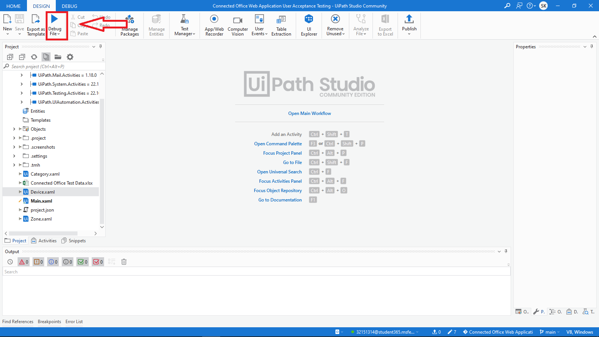

- You will be prompted to enter the login details to the https://connectedoffice-devicemanagement.azurewebsites.net/ website
- Entere credentials and check the checkbox indicated on the image below to save them then click "OK"

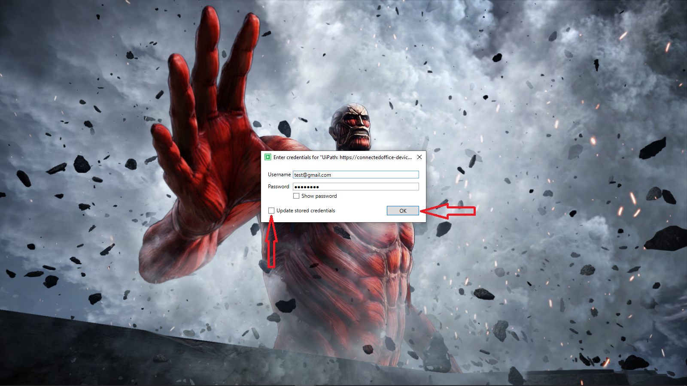

- Chrome will be Opened and the UiPath will use the provided credentials to automatically log in

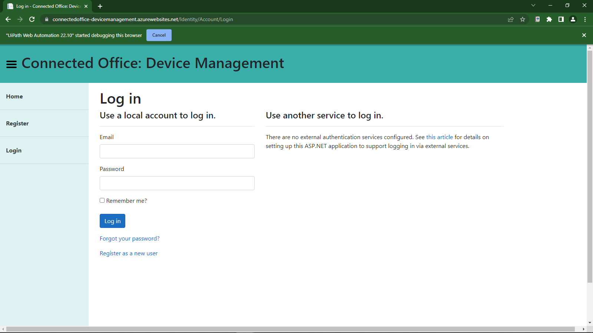

- It will first go to Zones page and open Excel in the back ground as seen in the image below

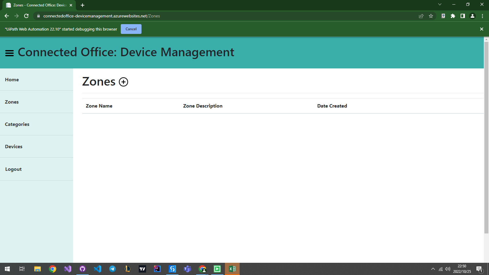

- It will read all the Zones in the Excel file and create them on the website 1 by 1
- As it is testing the Create functions on the website it will also test Editing, and Reading for each zone read from excel

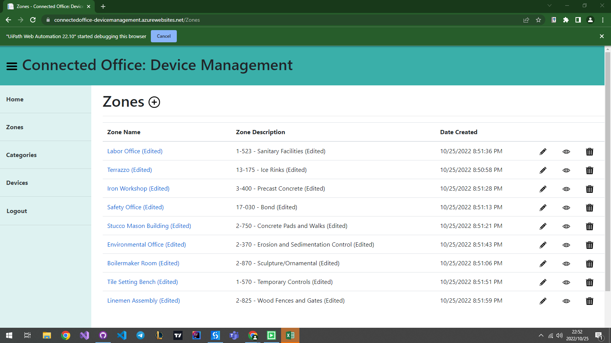

- After the Zone iterations it will read all the Categories in the Excel file and create them on the website 1 by 1

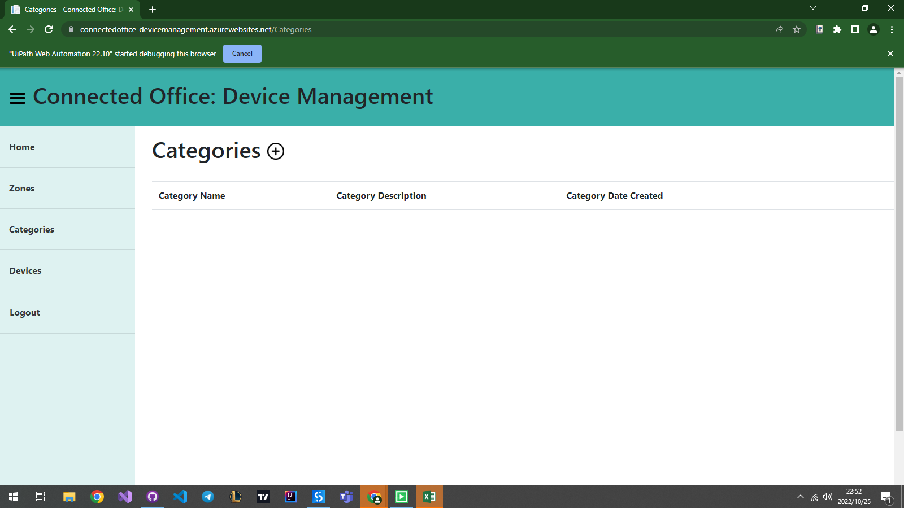

- As it is testing the Create functions on the website it will also test Editing, and Reading for each category read from excel

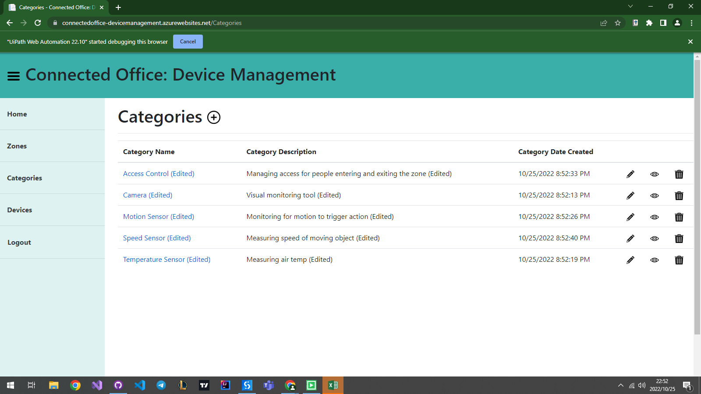

- After the Category iterations it will read all the Devices in the Excel file and create them on the website 1 by 1

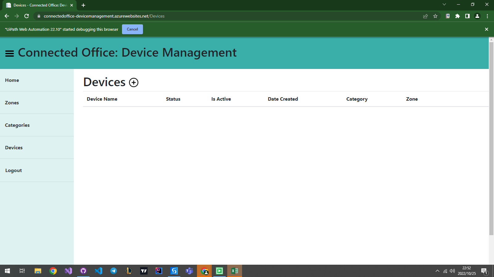

- As it is testing the Create functions on the website it will also test Editing, and Reading for each device read from excel

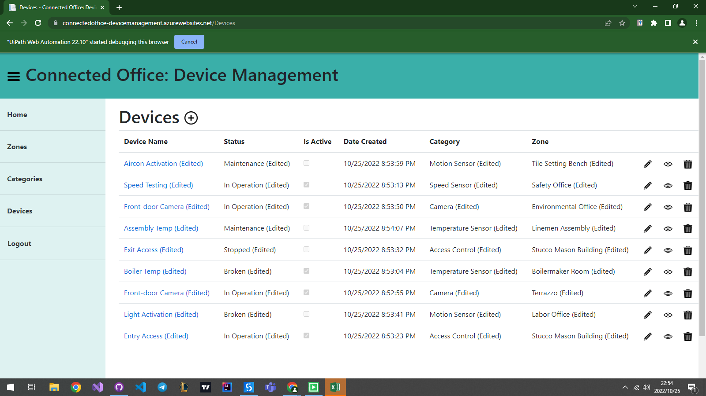

- Atfer testing the Create, Update and Read it will now test delete by deleting each and every device it created

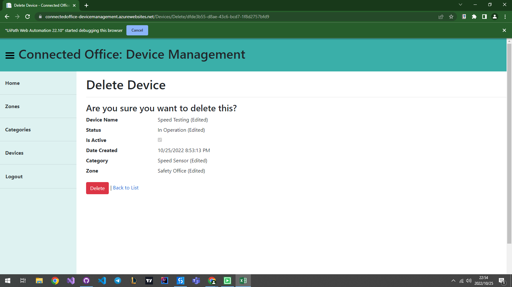

- After deleting Devices it will now test Zone delete by deleting each and every zone it created

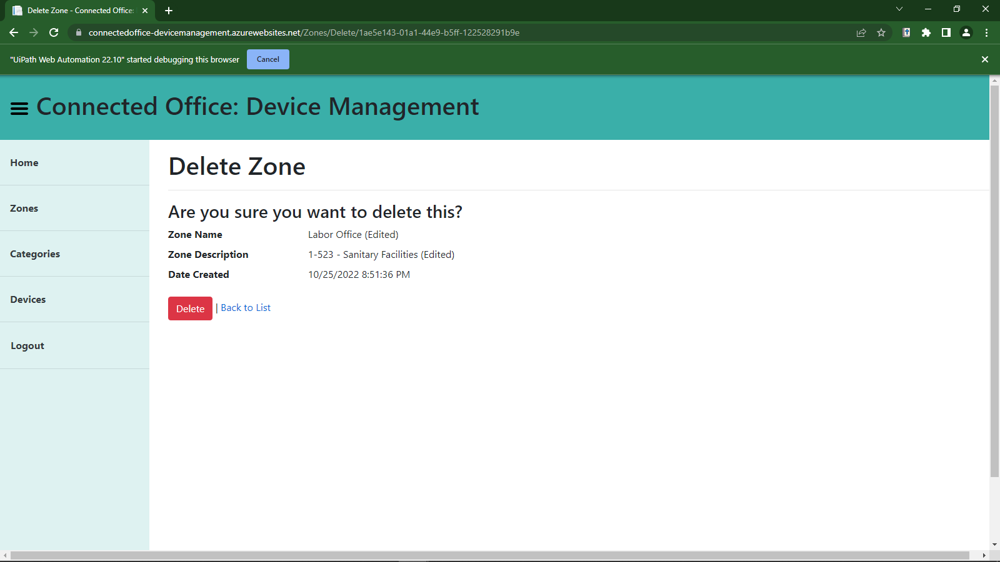

- After deleting Zones it will now test Category delete by deleting each and every category it created

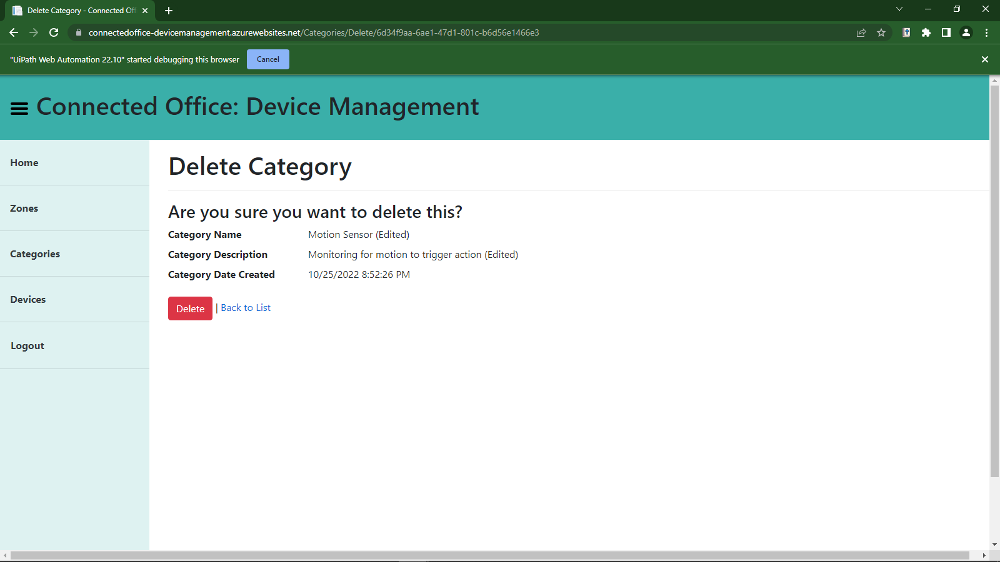

- After testing All the CRUD (Create, Read, Update, Delete) automations it will write the results to an Excel file showing wich items and operations failed or passed indicated by TRUE if successful or FALSE if it failed.
- Then it will go back to UiPath and as indicated in the image below you can see how long it took to perform the Automation

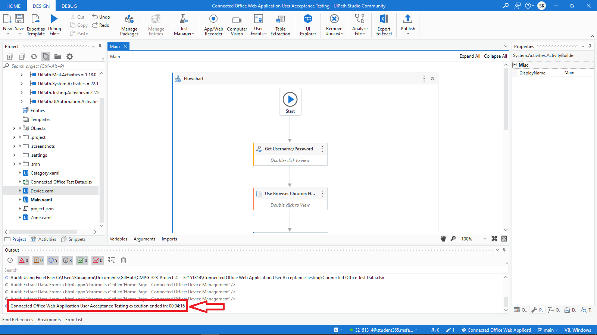
